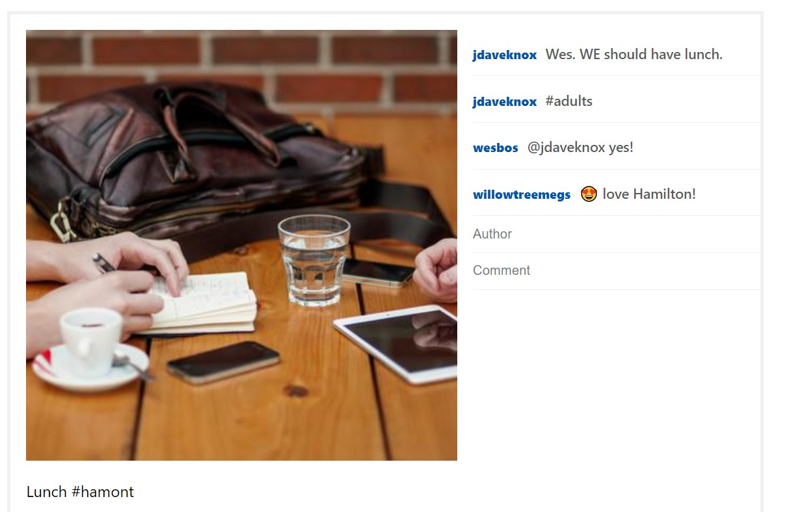

# Insta-clone
- Built an Instagram demo website i.e. clone using HTML, CSS and JavaScript.
- Function: By refreshing the page, all posts are constantly changing. We can like the post on same page. If you wish to read and add a comment to a post, you will be redirected to another page for this purpose.
- All changes are temporary.

## Like the post (Lunch #hamont) on page 1

## Comments in page 2

 
 
_Any doubts?  --> Ask me on [website](https://swasdas.github.io/) or [mail](mailto:swastik.sarc@gmail.com) me._
